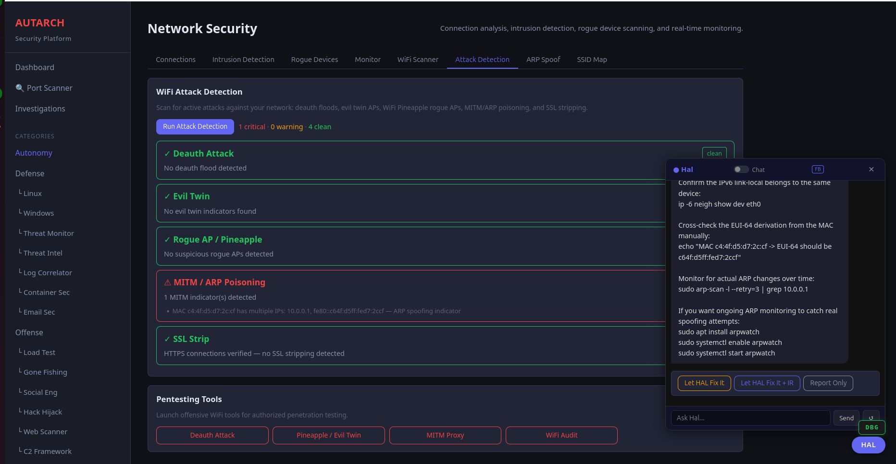

```
      /\
     /  \
    / /\ \
   / /__\ \   _    _   _____    _    ____     ____   _   _
  / /____\ \ | |  | | |_   _|  / \  |  _ \   / ___| | | | |
 / /  /\  \ \| |  | |   | |   / _ \ | |_) | | |     | |_| |
/ /  /  \  \ \ |  | |   | |  / ___ \|  _ <  | |___  |  _  |
\/  /    \  \/  \__| |  | | / /   \ \ | \ \  \____| |_| |_|
 \_/      \_/\______|   |_|/_/     \_\_|  \_\ANARCHY IS LIFE
```                                          LIFE IS ANARCHY

# AUTARCH v1.9

**Autonomous Tactical Agent for Reconnaissance, Counterintelligence, and Hacking**

By **darkHal Security Group** & **Setec Security Labs**

---

---

## Overview

AUTARCH is a modular security platform that unifies defensive hardening, offensive testing, forensic analysis, network security monitoring, OSINT reconnaissance, and attack simulation into a single web-based dashboard. It ships with **1,130+ web routes** across **67 route files**, **79 HTML templates**, **73 CLI modules**, and **40+ core framework files**. The platform integrates local and cloud LLM backends (llama.cpp, Claude, OpenAI, HuggingFace), an autonomous AI agent, an MCP server for external AI tool use, a privileged daemon architecture for safe root operations, an encrypted vault for secrets, hardware device management over WebUSB, and a companion Android application.

AUTARCH indexes **25,475 OSINT sites** for reconnaissance and provides real-time AI-powered analysis of every defensive scan through the HAL auto-analyst system.


---

---

## New in v1.9

- **Remote Monitoring Station** — PIAP (Platform Integration & Access Profile) system for managing remote devices (routers, adapters, pineapples). Drop a `.piap` config file in `data/piap/` and it auto-appears in the UI with full radio control, monitor mode, channel hopping, and remote capture
- **SSH / SSHD Manager** — Full SSH configuration management: edit sshd_config, manage keys, fail2ban integration, connection testing
- **Network Security Suite** — 8-tab network defense dashboard: connections, IDS, rogue device detection, real-time monitor, WiFi scanner, attack detection, ARP spoof detection, SSID mapper
- **HAL Auto-Analyst** — Every defensive tool automatically sends output to the loaded LLM for real-time analysis, risk scoring, and remediation suggestions
- **Privileged Daemon Architecture** — Flask runs as a normal user; a root daemon handles privileged operations over a Unix socket with HMAC-SHA256 authentication and a strict command whitelist (68 whitelisted commands plus 2 built-in Python actions, 45 blocked)
- **Encrypted Vault** — AES-encrypted storage for API keys and secrets, replacing plaintext config entries
- **MCP Server** — Expose AUTARCH tools to Claude Desktop, Claude Code, and other MCP clients via SSE transport
- **Module Creator** — Build new AUTARCH modules from the web UI with template scaffolding
- **GTK Desktop Launcher** — Native GTK3 launcher for starting/stopping the web server and daemon, managing settings, viewing logs
- **SSID Mapper** — Scan and map nearby wireless networks with signal strength, encryption type, and channel info
- **ARP Spoof Detection** — Real-time detection of ARP poisoning attacks on your network
- **WiFi Attack Detection** — Detect deauthentication floods, evil twin APs, and other wireless attacks
- **HAL Memory** — Persistent encrypted memory for the HAL AI agent across sessions
- **Codex Training System** — Build training datasets from AUTARCH's own codebase for fine-tuning

---

## Features

### Defense & Monitoring
- System hardening audits (Linux + Windows), firewall checks, permission analysis, security scoring
- Network Security suite with 8 specialized tabs
- Intrusion detection, rogue device scanning, real-time packet monitoring
- Log correlation and SIEM-style analysis
- Incident response playbooks and forensic acquisition
- Container security auditing (Docker, Podman)
- Email security analysis (SPF, DKIM, DMARC, header forensics)

### Offense & Simulation
- Metasploit & RouterSploit integration with live SSE streaming
- Attack simulation, port scanning, password auditing, payload generation
- C2 framework, reverse shell generator (multi-language)
- WiFi deauthentication, MITM proxy, load testing
- Exploit development workspace
- Phishing simulation, social engineering toolkit

### Analysis & Forensics
- File forensics, hex dumps, string extraction, entropy analysis
- Malware sandbox with behavioral analysis
- Reverse engineering workspace
- Steganography detection and embedding
- Anti-forensics toolkit
- Log correlation engine

### OSINT & Reconnaissance
- Email, username, phone, domain, IP reconnaissance across **25,475 indexed sites**
- Network mapper with topology visualization
- Threat intelligence feeds and IoC lookups
- GeoIP resolution, DNS enumeration, WHOIS

### Hardware & Mobile
- ADB/Fastboot over WebUSB, ESP32 flashing via Web Serial
- Android anti-stalkerware/spyware shield with signature-based scanning
- BLE scanner, RFID tools, SDR tools
- Pineapple integration, Starlink research tools

### AI & Automation
- **Agent HAL** — Autonomous AI agent with tool use, available as a global chat panel
- **HAL Auto-Analyst** — Automatic LLM analysis of all defensive tool output
- **MCP Server** — Expose tools to external AI clients
- **Autonomy Engine** — Rule-based autonomous threat response
- 4 LLM backends: llama.cpp (GGUF), HuggingFace Transformers, Claude API, OpenAI-compatible API
- Multi-model routing (SLM, SAM, LAM tiers)

### Infrastructure
- Privileged daemon for safe root operations
- Encrypted vault for API keys and credentials
- WireGuard VPN tunnel management
- UPnP automated port forwarding
- DNS nameserver with custom zone management
- Web-based Metasploit console with live terminal
- Debug console with 5 filter modes
- Report engine with PDF/HTML export
- Encrypted module system for sensitive payloads

---

## Architecture

```
start.sh                    # Launch script (detects venv, starts launcher)
autarch.py                  # CLI entry point (73 modules)
launcher.py                 # GTK3 desktop launcher
core/                       # 40+ core framework files
  agent.py                  #   Autonomous AI agent
  config.py                 #   Configuration management
  daemon.py                 #   Privileged root daemon (shell, packet capture, WiFi scan)
  hal_analyst.py            #   HAL auto-analysis engine
  hal_memory.py             #   Persistent encrypted AI memory
  llm.py                    #   LLM backend router
  mcp_server.py             #   MCP protocol server
  vault.py                  #   Encrypted secret storage
  wireguard.py              #   VPN management
  msf.py                    #   Metasploit interface
  discovery.py              #   Network/BT/mDNS discovery
  ...
modules/                    # 73 loadable modules
  defender.py               #   Linux defense
  defender_windows.py       #   Windows defense
  forensics.py              #   File forensics
  net_mapper.py             #   Network topology
  threat_intel.py           #   Threat intelligence
  ...
web/
  app.py                    # Flask app factory
  routes/                   # 67 route files (1,130+ routes)
    remote_monitor.py       #   PIAP remote device management
    ssh_manager.py          #   SSH/SSHD configuration & fail2ban
    network.py              #   Network security suite (8 tabs)
    module_creator.py       #   Web-based module builder
    ...
  templates/                # 79 Jinja2 templates
  static/                   # JS, CSS, WebUSB bundles
scripts/                    # Systemd services, build scripts, polkit policy
data/
  piap/                     # Device profiles (.piap files)
  codex/                    # Training data and codex
  ...                       # SQLite DBs, JSON configs, OSINT site database
autarch_settings.conf       # Master configuration file
```

---

## Quick Start

### Quick Launch

```bash
git clone https://github.com/digijeth/autarch.git
cd autarch
bash scripts/setup-venv.sh
./start.sh
```

`start.sh` launches the GTK desktop launcher which manages the daemon and web server — venv detection, daemon status, and pkexec elevation are handled automatically.

The web dashboard starts at `https://localhost:8080` (self-signed cert).

### Manual Start

```bash
# Start the daemon (handles privileged operations)
sudo python3 core/daemon.py &

# Start the web dashboard
python autarch.py
```

### Systemd Services (Headless / Server)

```bash
sudo cp scripts/autarch-web.service /etc/systemd/system/
sudo cp scripts/autarch-daemon.service /etc/systemd/system/
sudo systemctl enable --now autarch-daemon
sudo systemctl enable --now autarch-web
```

---

## The Daemon

AUTARCH uses a split-privilege architecture. The Flask web server runs as a normal user — it never has root access. A separate daemon process runs as root and is the single privileged process that handles ALL root operations: shell commands (`iptables`, `sysctl`, `systemctl`, etc.), packet capture (scapy sniff), and WiFi scanning (`iw scan`).

**Why?** Running a web server as root is a terrible idea. But security tools need root to do their job. The daemon solves this by acting as a controlled gateway.

**How it works:**

1. The daemon listens on a Unix domain socket at `/var/run/autarch-daemon.sock`
2. Every request is signed with **HMAC-SHA256** using a shared secret generated at daemon startup
3. Requests include a nonce for replay protection (30-second expiry window)
4. The daemon enforces a strict **command whitelist** — 68 pre-approved shell commands can be executed, plus 2 built-in Python actions:
   - `__capture__` — runs scapy packet capture as root, writes pcap files
   - `__wifi_scan__` — runs `iw` WiFi scanning as root
5. **45 commands are explicitly blocked** (rm, mkfs, dd, shutdown, etc.) as a safety net
6. The shared secret is readable only by the daemon (root) and the autarch user's group

**Starting the daemon:**

```bash
# Direct
sudo python3 core/daemon.py

# Via systemd
sudo systemctl start autarch-daemon

# Via the GTK launcher (uses pkexec for elevation)
python launcher.py
```

---

## HAL AI Analyst

Every defensive and analysis tool in AUTARCH can automatically send its output to HAL — the built-in AI analyst powered by whatever LLM backend you have configured.

When you run a scan, check logs, or analyze a file, HAL:

1. Receives the raw tool output
2. Analyzes it in context (what tool produced it, what was being scanned)
3. Returns a structured assessment: **Summary**, **Findings**, **Risk Level** (CLEAN/LOW/MEDIUM/HIGH/CRITICAL), and **Recommendation**
4. Can suggest specific fixes or commands to remediate issues
5. Experimental: can auto-apply fixes with user confirmation

Offensive tools (exploit dev, C2, social engineering, etc.) are excluded from auto-analysis by design — HAL only analyzes defensive output.

---

## MCP Server

AUTARCH exposes its tools via the **Model Context Protocol** for use with Claude Desktop, Claude Code, and other MCP-compatible clients.

**Configuration** (in `autarch_settings.conf`):

```ini
[mcp]
enabled = true
transport = sse
host = 0.0.0.0
port = 8081
```

**Connecting Claude Desktop:**

Add to your Claude Desktop MCP config:

```json
{
  "mcpServers": {
    "autarch": {
      "url": "http://localhost:8081/sse"
    }
  }
}
```

**Connecting Claude Code:**

```bash
claude mcp add autarch http://localhost:8081/sse
```

This gives Claude direct access to AUTARCH's security tools — network scanning, WHOIS lookups, DNS enumeration, GeoIP resolution, packet capture, and more.

---

## Network Security

The Network Security module provides 8 specialized tabs for monitoring and defending your network:

| Tab | Function |
|-----|----------|
| **Connections** | Active connection analysis, ARP table inspection, interface enumeration |
| **Intrusion Detection** | IDS rule scanning, anomaly detection, alert management |
| **Rogue Devices** | Scan for unknown/unauthorized devices on your network, maintain a known-device whitelist |
| **Monitor** | Real-time packet capture and connection monitoring with live streaming |
| **WiFi Scanner** | Enumerate nearby wireless networks with signal strength, encryption, and channel data |
| **Attack Detection** | Detect deauthentication floods, evil twin APs, beacon anomalies, and other wireless attacks |
| **ARP Spoof** | Real-time ARP poisoning detection — alerts when MAC/IP mappings change unexpectedly |
| **SSID Map** | Map and track wireless networks over time, identify hidden networks and rogue APs |

All network operations that require root (interface scanning, packet capture, ARP manipulation) are handled through the privileged daemon — the web server itself never runs as root.

---

## Configuration

All settings live in `autarch_settings.conf`, auto-generated on first run. Key sections:

| Section | Purpose |
|---------|---------|
| `[autarch]` | Core settings: module path, LLM backend selection, verbosity |
| `[web]` | Web server: host, port, secret key, MCP port |
| `[llama]` | llama.cpp settings: model path, context size, GPU layers, sampling |
| `[claude]` | Anthropic API: key, model, max tokens |
| `[huggingface]` | HuggingFace: API key, model, endpoint, provider |
| `[transformers]` | Local transformers: model path, device, quantization |
| `[msf]` | Metasploit RPC: host, port, credentials |
| `[rsf]` | RouterSploit: install path, defaults |
| `[wireguard]` | VPN: config path, interface, subnet, DNS |
| `[upnp]` | Port forwarding: internal IP, refresh interval, mappings |
| `[osint]` | Recon: thread count, timeout, NSFW toggle |
| `[pentest]` | Pipeline: max steps, chunk size, auto-execute |
| `[autonomy]` | Autonomous response: intervals, threat threshold, agent limits |
| `[agents]` | AI agents: backend, model selection, step limits per provider |
| `[mcp]` | MCP server: transport, auth, rate limits, SSL, tool timeouts |
| `[discovery]` | Device discovery: mDNS, Bluetooth |
| `[revshell]` | Reverse shell listener: host, port, auto-start |
| `[slm]` / `[sam]` / `[lam]` | Multi-tier model routing (small, standard, large) |

### Encrypted Vault

API keys and sensitive credentials can be stored in the encrypted vault instead of plaintext config:

```
data/vault.enc
```

The vault uses AES encryption and is unlocked at runtime. Manage vault entries through the web UI Settings page or the CLI.

---

## Ports

| Port  | Service |
|-------|---------|
| 8080  | Web Dashboard (HTTPS) |
| 8081  | MCP Server (SSE) |
| 17321 | Archon Server (Android companion) |
| 17322 | Reverse Shell Listener |
| 51820 | WireGuard VPN |

---

## Platform Support

- **Primary:** Linux (Orange Pi 5 Plus, RK3588 ARM64) — all features supported
- **Supported:** Windows 10/11 (x86_64) — daemon features require WSL or are unavailable
- **WebUSB:** Chromium-based browsers required for direct-mode hardware access
- **Android:** Companion app (Archon) for remote management

---

## License

Restricted Public Release. Authorized use only — activity is logged.

## Disclaimer

AUTARCH is a security research and authorized penetration testing platform. Use only on systems you own or have explicit written authorization to test. Unauthorized access to computer systems is illegal. The authors accept no liability for misuse.

---

## A Note from the Author

*This may be the last application I write as my battle against the evilness of the web may be my own downfall. I leave you with this:*

---

### AI and Liberty: Who Gets to Decide?

**By: SsSnake -- Lord of the Abyss --

Artificial intelligence can erode freedoms or strengthen them—the outcome depends on who controls it, and how we respond to it. The people need to remember, if we don't like the laws being passed or how its being used, let your Representatives know, and if they don't listen, replace them. Their job is to represent us. Not make decisions for us. darkHal is an apolitical group and do not support either party. We do not give a shit about your politics, we only care about the 1's and 0's.

Artificial intelligence is often presented as a tool of progress—streamlining services, analyzing massive datasets, and empowering individuals. Yet, like any technology, AI is neutral in essence, except when it is deliberately trained not to be. Its ethical impact depends not only on how it is deployed, but also on who deploys it. When placed in the hands of governments, corporations, or malicious actors, AI systems can be weaponized against the very constitutional rights designed to protect citizens. Understanding these risks is essential if liberty is to be preserved in an increasingly automated world.

One of the main areas of concern lies in the freedom of speech and expression. AI-driven content moderation and recommendation systems, while designed to maintain civility online and recommend material a person may relate to, have the potential to silence dissent and reinforce messages of distrust, hate, and violence. Algorithms, trained to identify harmful or "unsafe" speech, may suppress valid opinions or target certain groups to take their voice away. Citizens who suspect they are being monitored because their posts have been flagged may begin to self-censor, creating a chilling effect that undermines open debate—the cornerstone of American democracy. At the same time, AI-generated deepfakes and manipulated media make it more difficult for the public to separate fact from fiction, creating an environment where truth can be drowned out by manufactured lies. For example, imagine a local election in which a convincing AI-generated video surfaces online showing a candidate making inflammatory remarks they never actually said. Even if the video is later debunked, the damage is already done: news cycles amplify the clip, and social media spreads it widely to millions in a matter of seconds. Voters' trust in the candidate is shaken. The false narrative competes with reality, leaving citizens unsure whom to believe and undermining the democratic process itself. This risk, however, can be mitigated through rapid-response verification systems—such as forcing micro-watermarking in manufactured media at the time of creation, embedded in the pixels, or deploying independent fact-checking networks that can authenticate content before it spreads. Public education campaigns that teach citizens how to identify digital manipulation can also help blunt the impact, ensuring that truth has a fighting chance against falsehoods.

Yet it is worth acknowledging that many of these defenses have been tried before—and they often fall short. Watermarking and authentication tools can be circumvented or stripped away. Fact-checking networks, while valuable, rarely match the speed and reach of viral misinformation. Public education campaigns struggle against the sheer realism of today's generative tools and ignorance of AI capabilities. I still hear people saying that AI cannot create applications on its own, even when the evidence is in front of them. We live in a time where a human voice can be convincingly cloned in less than thirty seconds, and a fifteen-minute training sample can now reproduce not just words but the subtle cues of emotion and tone that even skilled listeners may find impossible to separate from fabrication. This raises a profound question: if any statement can be manufactured and any artifacts explained, how do we defend truth in a world where authentic voices can be replicated and reshaped at will?

Some argue that forcing "guardrails" onto AI systems is the only way to prevent harm. Yet this collides with a deeper constitutional question that we must also consider: do programmers have a First Amendment right to express themselves through source code? In American courts, the answer is yes. The courts have recognized that computer code is a form of speech protected under the First Amendment. In Bernstein v. U.S. Department of State (1999), the Ninth Circuit held that publishing encryption code was protected expression, striking down government attempts to license and restrict its dissemination. The Sixth Circuit echoed this in Junger v. Daley (2000), reinforcing that code is not just functional—it communicates ideas. Earlier battles, from United States v. Progressive, Inc. (1979), where the government unsuccessfully tried to block publication of an article describing how to build a hydrogen bomb, to the Pentagon Papers case (1971), where the Supreme Court rejected government efforts to stop newspapers from printing a classified history of the Vietnam War, established how rarely the state can justify restraining the publication of technical or sensitive information without a direct threat to national security. These cases highlight the judiciary's consistent skepticism toward prior restraint, especially when national security is invoked as justification. Although the current Supreme Court has shown it has no issue favoring the rights of specific groups while abridging the rights of others. It is also no secret courts have been using AI more and more to research and write rulings, with little understanding of how LLMs work.

That same tension between liberty and security also extends beyond speech into the realm of personal privacy. The right to privacy was enshrined in the Fourth Amendment because the framers of the Bill of Rights did not want the government to become like the British crown, empowered to search, seize, and surveil without restraint. AI has enabled exactly that, with the assistance of companies like Google, Meta, and our cellphone providers, who have given real-time access to our location, search history, and everything else our phones collect to anyone who could pay—including the government—regardless of whether they had a warrant. Not that long ago, that realization would have led to mass protests over surveillance. And it did. A government program known as PRISM was exposed, and it was headline news for months. People were outraged for years. But when the news broke about T-Mobile, Verizon, and AT&T selling real-time information to anyone with money, the only ones who got upset were the FTC. Republicans in Congress ranged from being annoyed to furious—at the FTC's "overreaching powers." Only a few cared about the companies themselves, and for specific reasons. The Democrats demanded CEOs answer their questions and called a few hearings, but did nothing. Most people do not even know this happened. The outcome? A fine. This was far worse than PRISM, and nobody cared. With the help of AI, that information has been used to create targeted ads and complete profiles about U.S. citizens that include everything from where you go every day to what kind of underwear you buy.

Sadly, people have become too stupid to realize that once you realize your rights have been stripped away—because they've been used on you or against you—it's too late to do anything. They do not understand that the argument isn't about whether you have something to hide or not, or just accepting it with a shrug—"because that's just how it is." It's about not letting the government erode our rights. Today's tools such as instant-match facial recognition, predictive policing software, and real-time geolocation tracking allow authorities to monitor citizens on a scale once unimaginable except in East Germany—all without a warrant ever being issued. And until the courts make a ruling in the cellphone provider case, it all seems legal as long as it's a private company doing it. When these systems claim to forecast behavior—predicting who might commit a crime or who might pose a security risk—they open the door to pre-emptive action that undermines the presumption of innocence, and they are being relied on more and more. These are systems prone to issues such as daydreaming or agreeing with their user just because.

Some technologists argue that the only way to defend against such surveillance is to fight algorithms with algorithms. One emerging approach is the use of a tool we are planning on releasing: darkHal's "Fourth Amendment Protection Plugin," a system designed not merely to obfuscate, but to actively shield users from AI-driven profiling. Rather than attempting the impossible task of disappearing from the digital landscape, darkHal generates layers of synthetic data—fake GPS coordinates, fabricated browsing histories, fake messages, simulated app usage, and false forensic metadata. By blending authentic activity with thousands of AI-generated content items, it prevents surveillance algorithms from producing reliable conclusions about an individual's behavior or location.

The idea reframes privacy as an act of digital resistance. Instead of passively accepting that AI will map and monitor every action, tools like darkHal inject uncertainty into the system itself. Critics caution that this tactic could complicate legitimate investigations or erode trust in digital records. Yet supporters argue that when the state deploys AI to surveil without warrants or probable cause, citizens may be justified in using AI-driven counter-surveillance tools to defend their constitutional protections. In effect, darkHal embodies a technological assertion of the Fourth Amendment—restoring the principle that people should be secure in their "persons, houses, papers, and effects," even when those papers now exist as data logs and metadata streams.

These tools then create concerns about due process and equal protection under the law. Courts and law enforcement agencies increasingly turn to algorithmic decision-making to guide bail, sentencing, and parole decisions. Police use AI-driven tools to create reports that have zero oversight, with no way to verify if an error in the facts was due to a malfunctioning AI or a dishonest law enforcement officer. According to Ars Technica, some of these models are trained on biased data, reinforcing the very disparities they are meant to reduce. Their reasoning is often hidden inside opaque "black box" systems, leaving defendants and their attorneys unable to challenge or even understand the basis for adverse rulings. In extreme cases, predictive models raise the specter of "pre-crime" scenarios, where individuals are treated as guilty not for what they have done, but for what a machine predicts they might do.

If the courtroom illustrates how AI can erode individual rights, the public square shows how it can chill collective ones. The right to assemble and associate freely is another area where AI can become a tool of control. Advanced computer vision allows drones and surveillance cameras to identify and track participants at protests, while machine learning applied to metadata can map entire networks of activists. Leaders may be singled out and pressured, while participants may face intimidation simply for exercising their right to gather. In some countries, AI-based "social scoring" systems already penalize individuals for their associations, and similar mechanisms could emerge elsewhere—such as in the U.S.—if left unchecked.

The erosion of assembly rights highlights a broader truth: democracy depends not only on the ability to gather and speak, but also on the ability to participate fully in elections. If the public square is vulnerable to AI manipulation, the ballot box is equally at risk. Even the most fundamental democratic right—the right to vote—is not immune. Generative AI makes it easier than ever to flood social media with targeted disinformation, tailoring falsehoods to specific demographics with surgical precision. Automated campaigns can discourage turnout among targeted groups, spread confusion about polling locations or dates, or erode faith in electoral outcomes altogether. If applied to electronic voting systems themselves, AI could exploit vulnerabilities at a scale that would threaten confidence in the legitimacy of elections.

These risks do not mean that AI is inherently incompatible with constitutional democracy. Rather, they highlight the need for deliberate safeguards such as equal access. If the police can monitor us without warrants in ways the founding fathers could not even fathom—but clearly did not want or would approve of—what's to stop them from taking our other rights away based on technology simply because it didn't exist 249 years ago? Transparency laws can give citizens the right to know when AI is being used, how it was trained, and how it arrives at its conclusions. Independent oversight boards and technical audits can ensure accountability in government deployments. But most importantly, humans must retain ultimate judgment in matters of liberty, justice, and political participation. And if citizens are being monitored with these tools, so should law enforcement and, when possible, the military. Finally, promoting access and digital literacy among the public—on how LLMs are created, used, and how to use them—is essential, so that citizens recognize manipulation when they see it and understand the power—and the limits—of these systems.

Yet, if left unchecked, artificial intelligence risks becoming a silent but powerful tool to erode constitutional protections without the end user even realizing it is happening. However, if governed wisely, the same technology can help safeguard rights by exposing corruption, enhancing transparency, and empowering individuals. The real question is not whether AI will shape our constitutional order; it is how we will let it.

---

## Our Rambling Rant...Who We Are And Why We Do It


We are dedicated to providing cutting-edge security solutions at no cost to the community, and since our source code is protected speech, we are not going anywhere. Criminals makes millions every year selling tools that are designed to be point and disrupt. So we decided why not do the same with security tools, except at no cost for the home user. Until now, governments, criminal organizations and other groups have paid hackers thousands of dollars to buy what are known as 0-day exploits, flaws in software you use everyday that have no fix or patches. Others report them to the manufacturer for money in bounty programs. We use them to create tools that protect YOU and your family members in real-time from these 0-days, as well as advance the right to repair movement and homebrew scene by exploiting these same flaws for good/fun.

If you are asking yourself why would we do this? It because we are the hackers who still have the core belief that, like anarchy is not about violence and smashing windows, hacking is not about damaging lives, stealing data or making money. Its about pushing boundaries, exploring, finding new and better ways of doing something and improving peoples lives. And for the longest time, hackers were at the forefront of the tech world. They didn't have to buy their own platforms or pay people to like them. Hackers didn't care how many people followed them. Instead of using their real names, they had monikers like Grandmaster Ratte, Mudge, Sid Vicious...and yes, even Lord British.

They taught us hacking was more a mentality like punk then a adjective describing an action. They taught us that just because we can doesn't meant we should, and if someone tells us we cant, we will prove them wrong...just so we can say we did it. For us, its about having fun, a very important part of living as long as your not hurting other people. And that's what the original hackers from MIT, Berkley and Cal-tech taught us, dating all the way back to the 1950's when computers we more of a mechanical machine and looked nothing like what a computer today looks like, let alone functions like one.

But everything changed after 9/11 happened. While it was very important people like the members of the Cult of The Dead Cow and other groups came to aid of those fighting the war against a brand new world, one the government knew nothing about (due their own fault). But as the war dragged on and and computers evolved, the hackers did not find the balance between going to far and remembering what the word hacker once meant. They forgot what the core of being one was about. While making money is fine, those tools ended up on the phones and computers of dissidents, reporters and have led to the deaths of people seeking nothing more than a better life or for trying to report on war crimes. They have become the go to tool for dictators controlling their populations. And those tools have continued to evolve. With the dawn of a new AI era, surveillance spyware, crypto-jackers and info stealers are being created faster than ever. And with only a handful of the old guard still active working on projects such as Veilid trying to undo the damage that was done, we are losing the war on safety, privacy and freedom.

While the immediate effect of these tools were not known to many, and it took years of court cases and FOI requests to reveal just how they were being used by the US government and others, the real damage was already done. Then when these tools were leaked, instead of helping on the front lines to stop the damage being done, the people who created them slipped into C-Suite jobs or government advisor roles making millions with their true backgrounds completely hidden.

That is why we formed this group. As the old guard moved on, not looking back, no one stepped up to take their place and instead left the next generation to learn on their own. And while some of these groups had the right idea, they had the wrong execution. You know the saying, "The path to hell is paved with good intentions."

Besides making tools to to help stop the current war online, we also hope to to lead by example. To show the current generation that their are better ways then being malicious, such as releasing tools that will protect you from 0-day exploits. Tools that will outsmart the spyware and malware/ransomware that has infected millions of computer. But also how to still have fun with it.

No, we are not legion. And some of us are getting old, so we might forget. But its time hackers are no longer a bad word again. For a full history of the hacker revolution, there are some great books. I suggest reading Cult of the Dead Cow: How the Original Hacking Supergroup Might Just Save the World by Joseph Mann. (When I was just a little script kiddie myself in the early 90's, I spent countless hours on their BBS, reading and learning everything I could, so I'm a little biased. And a little traumatized.)

This is not some manifesto, its just a lesson in history and a plea to other hackers. If we don't want history to repeat at the dawn of this new computing era we just entered, we need hackers on the side of....well chaotic good. If you want to join us, find us (we really are not hiding).

*Note: While we try to stay away from politics, this has to be said because no one is saying it. Everyone rather cower to someone who thinks they can do whatever they hell they want. People are f*cking tired of it, and tired of the people we elected to represent us to scared to say what everyone is thinking.*

*Links to our github and automated pentesting and offensive models will be re-added once our website resigned is complete. For now, find them on Huggingface.*

---

### Europe Must Remember: America Needs Us More Than We Need Them

The silence from Brussels and London has been deafening.

As President Trump openly muses about acquiring Greenland—including by force—European leaders have responded with little more than diplomatic throat-clearing and carefully worded statements of concern. This timidity is not statesmanship. It is abdication.

Let us be blunt: Greenland is European territory. It is an autonomous region of Denmark, a NATO ally, an EU-associated territory. Any attempt to take it by force would be an act of war against a European nation. That this even requires stating reveals how far European powers have allowed themselves to be diminished in American eyes.

The EU and the UK have seemingly forgotten what they are. These are nations and institutions that predate the American experiment by centuries—in some cases, by millennia. Rome rose and fell before English common law was codified. The Treaty of Westphalia established the modern international order while America was still a collection of colonies. Europe has survived plagues, world wars, occupations, and the collapse of empires. It will survive a trade dispute with Washington.

The same cannot be said in reverse.

**The Arsenal of Resistance**

Europe is not without weapons in an economic conflict—and they are far more potent than Washington seems to appreciate.

Consider pharmaceuticals. European companies supply a staggering portion of America's medicines. Novo Nordisk, Sanofi, AstraZeneca, Roche, Bayer—these names are not optional for American patients. An export restriction on critical medications would create a healthcare crisis within weeks. The United States simply does not have the domestic capacity to replace these supplies.

Then there is aerospace. Airbus delivers roughly half of all commercial aircraft purchased by American carriers. Boeing cannot meet domestic demand alone, as its ongoing production disasters have made painfully clear. European aviation authorities could slow-walk certifications, delay deliveries, or restrict parts supplies. American airlines would feel the pinch immediately.

Financial services offer another pressure point. London remains a global financial hub despite Brexit. European banks hold substantial American assets and conduct enormous daily transaction volumes with US counterparts. Regulatory friction, transaction delays, or capital requirements could introduce chaos into markets that depend on seamless transatlantic flows.

Luxury goods, automobiles, specialty chemicals, precision machinery, wine and spirits, fashion—the list continues. Europe exports goods America's wealthy and middle class have grown accustomed to. Tariffs work both ways, and European consumers can find alternatives for American products far more easily than Americans can replace a BMW, a bottle of Bordeaux, or a course of medication.

And then there is the nuclear option: the US dollar's reserve currency status depends in part on European cooperation. If the EU began conducting more trade in euros, requiring euro settlement for energy purchases, or coordinating with other blocs to reduce dollar dependence, the long-term consequences for American economic hegemony would be severe. This would not happen overnight, but the mere credible threat of movement in this direction should give Washington pause.

**The Costs for America**

The consequences of a genuine EU-US economic rupture would be asymmetric—and not in America's favor.

American consumers would face immediate price shocks. Goods that currently flow freely across the Atlantic would become scarce or expensive. Pharmaceutical shortages would strain an already fragile healthcare system. Automotive supply chains would seize. Technology companies dependent on European components, software, and talent would scramble.

American farmers, already battered by previous trade wars, would lose one of their largest export markets. Soybeans, pork, poultry, and agricultural machinery would stack up in warehouses while European buyers turned to Brazil, Argentina, and domestic producers.

The financial sector would face regulatory balkanization. American banks operating in Europe would confront new compliance burdens. Investment flows would slow. The certainty that has underpinned transatlantic commerce for decades would evaporate.

Perhaps most critically, American diplomatic isolation would accelerate. If Washington demonstrates it is willing to bully its closest allies, why would any nation trust American commitments? The soft power that has been America's greatest asset since 1945 would erode further, pushing more countries toward Beijing's orbit—precisely the outcome American strategists claim to fear most.

**The Ukraine Question**

Some will argue that European resistance to American pressure would harm Ukraine. This concern deserves acknowledgment—and a clear-eyed response.

Yes, American military aid has been critical to Ukraine's defense. Yes, a rupture in transatlantic relations could complicate the flow of weapons and intelligence. Yes, Kyiv would suffer if its two largest backers turned on each other.

But let us be absolutely clear about where responsibility would lie: with Washington.

Europe has already demonstrated its commitment to Ukraine. The EU has provided tens of billions in financial assistance, welcomed millions of refugees, imposed sweeping sanctions on Russia, and begun the long process of integrating Ukraine into European structures. This support would continue—and likely intensify—regardless of American posturing. If anything, American abandonment would accelerate European defense integration and military investment, ultimately producing a more capable and self-reliant European security architecture.

If Ukraine suffers because the United States chose to bully its allies rather than work with them, that is an American failure, not a European one. Europe did not pick this fight. Europe is not threatening to seize allied territory. Europe is not issuing ultimatums and demanding policy changes under threat of economic warfare.

Washington wants to play the bully and then blame Europe for the consequences? That narrative must be rejected categorically. The EU and UK should make clear: we will defend Ukraine, we will defend ourselves, and we will not be blackmailed. If the transatlantic relationship fractures, history will record who swung the hammer.

**A Call for Courage**

The United States depends on global supply chains for everything from pharmaceuticals to rare earth minerals, consumer electronics to industrial machinery. American manufacturing has been hollowed out over decades of offshoring. The country runs persistent trade deficits precisely because it cannot produce what it consumes. Europe, by contrast, maintains robust manufacturing bases, agricultural self-sufficiency in key sectors, and—critically—the institutional knowledge to rebuild what has atrophied.

Yes, a genuine economic rupture with America would be painful. Germany would need to revive its defense industrial base. European nations would need to accelerate military integration and spending. Supply chains would require restructuring. None of this would be pleasant or cheap.

But Europe would adapt. It always has.

The deeper issue is not economic arithmetic. It is the fundamental question of sovereignty. When the United States threatens to withdraw support unless European nations adopt particular policies—whether on trade, technology, or anything else—it is not behaving as an ally. It is behaving as a suzerain issuing commands to vassal states.

This must end.

European leaders need to communicate, clearly and publicly, that the transatlantic relationship is a partnership of equals or it is nothing. The United States does not dictate European trade policy. It does not dictate European environmental regulations. It does not dictate which nations Europe may conduct commerce with. And it absolutely does not get to annex European territory through threats or force.

If Washington wishes to play hardball, Brussels and London should be prepared to respond in kind. The tools exist. The leverage exists. The only question is whether European leaders have the spine to use them.

The current moment calls for steel, not silk. European leaders must remind Washington of a simple truth: alliances are built on mutual respect, not submission. The United States is not in charge of the world. It does not write the laws of other nations. And if it wishes to remain a partner rather than become an adversary, it would do well to remember that Europe has options—and the will to use them.

The only question is whether European leaders have the courage to say so.

---

### About darkHal Security Group

> *"There's a reason you separate military and the police. One fights the enemies of the state, the other serves and protects the people. When the military becomes both, then the enemies of the state tend to become the people."* — Commander Adama, Battlestar Galactica

---

## Acknowledgements

AUTARCH builds on the work of many outstanding open-source projects. We thank and acknowledge them all:

### Frameworks & Libraries

- [Flask](https://flask.palletsprojects.com/) — Web application framework
- [Jinja2](https://jinja.palletsprojects.com/) — Template engine
- [llama.cpp](https://github.com/ggml-org/llama.cpp) — Local LLM inference engine
- [llama-cpp-python](https://github.com/abetlen/llama-cpp-python) — Python bindings for llama.cpp
- [HuggingFace Transformers](https://github.com/huggingface/transformers) — ML model library
- [Anthropic Claude API](https://docs.anthropic.com/) — Cloud LLM backend
- [OpenAI API](https://platform.openai.com/docs/) — OpenAI-compatible LLM backend
- [FastMCP](https://github.com/jlowin/fastmcp) — Model Context Protocol server

### Security Tools

- [Metasploit Framework](https://github.com/rapid7/metasploit-framework) — Penetration testing framework
- [RouterSploit](https://github.com/threat9/routersploit) — Router exploitation framework
- [Nmap](https://nmap.org/) — Network scanner and mapper
- [Wireshark / tshark](https://www.wireshark.org/) — Network protocol analyzer
- [Scapy](https://scapy.net/) — Packet crafting and analysis
- [WireGuard](https://www.wireguard.com/) — Modern VPN tunnel

### Hardware & Mobile

- [@yume-chan/adb](https://github.com/nicola-nicola/nicola-nicola) — ADB over WebUSB
- [android-fastboot](https://github.com/nicola-nicola/nicola-nicola) — Fastboot over WebUSB
- [esptool-js](https://github.com/nicola-nicola/nicola-nicola) — ESP32 flashing in browser
- [Android Platform Tools](https://developer.android.com/tools/releases/platform-tools) — ADB & Fastboot CLI
- [esptool](https://github.com/nicola-nicola/nicola-nicola) — ESP32 firmware flashing
- [pyserial](https://github.com/pyserial/pyserial) — Serial port communication
- [pyshark](https://github.com/KimiNewt/pyshark) — Wireshark Python interface
- [scrcpy](https://github.com/Genymobile/scrcpy) — Android screen mirroring
- [libadb-android](https://github.com/nicola-nicola/nicola-nicola) — ADB client for Android

### Python Libraries

- [anthropic](https://github.com/anthropics/anthropic-sdk-python) — Anthropic Python SDK
- [openai](https://github.com/openai/openai-python) — OpenAI Python SDK
- [scapy](https://github.com/secdev/scapy) — Network packet manipulation
- [bcrypt](https://github.com/pyca/bcrypt) — Password hashing
- [requests](https://github.com/psf/requests) — HTTP client
- [msgpack](https://github.com/msgpack/msgpack-python) — Serialization (Metasploit RPC)
- [cryptography](https://github.com/pyca/cryptography) — Cryptographic primitives
- [PyCryptodome](https://github.com/Legrandin/pycryptodome) — AES encryption
- [Pillow](https://github.com/python-pillow/Pillow) — Image processing
- [qrcode](https://github.com/lincolnloop/python-qrcode) — QR code generation
- [zeroconf](https://github.com/python-zeroconf/python-zeroconf) — mDNS service discovery
- [PyInstaller](https://github.com/pyinstaller/pyinstaller) — Executable packaging
- [cx_Freeze](https://github.com/marcelotduarte/cx_Freeze) — MSI installer packaging

### Android / Kotlin

- [AndroidX](https://developer.android.com/jetpack/androidx) — Jetpack libraries
- [Material Design 3](https://m3.material.io/) — UI components
- [Conscrypt](https://github.com/nicola-nicola/nicola-nicola) — SSL/TLS provider for Android

### Build Tools

- [esbuild](https://esbuild.github.io/) — JavaScript bundler
- [Gradle](https://gradle.org/) — Android build system

### Data Sources

- [NVD API v2.0](https://nvd.nist.gov/developers/vulnerabilities) — National Vulnerability Database

---

*Built with discipline by darkHal Security Group & Setec Security Labs.*

# Your Project Title

Description of your project.

  

# Other sections...

Please confirm you want Copilot to make this change in the DigijEth/autarch repository on branch main.
Copilot finished thinking Copilot said: Let me check what's actually in your Let me check what's actually in your assets folder:Good news! The images do exist in your assets folder: demo1.png ✓ demo2.png ✓ demo3.png ✓ logo.png ✓ The issue is in your README.md image reference syntax. You're using this: Markdown  But the images are in the assets folder, not images. Change it to: Markdown  Let me update your README with the correct path:Good news — the images exist in your assets folder! I found: demo1.png ✓ demo2.png ✓ demo3.png ✓ logo.png ✓ The problem: Your README is still pointing to the old GitHub user attachment URL instead of the local path. I've updated your README to use the correct relative path: ./assets/demo1.png instead of the external CDN URL. The image should now display properly since it's referencing the file directly from your repository. If you want to use the other demo images, update the README accordingly: Markdown  The relative path method is more reliable and doesn't depend on external services. Loading file diff...
Skip to content

    DigijEth
    autarch

Repository navigation

    Code
    Issues
    Pull requests
    Actions
    Projects
    Wiki
    Security
    Insights
    Settings

Files
t

    .config
    assets
        demo1.png
        demo2.png
        demo3.png
        logo.png
    autarch_companion
    core
    data
    docs
    modules
    scripts
    services
    src
    web
    .gitignore
    README.md
    autarch.ico
    autarch.py
    autarch_settings.conf
    autarch_web.py
    icon.svg
    launcher.py
    package-lock.json
    package.json
    requirements.txt
    start.sh

    autarch

/assets/
DigijEthclaude
DigijEth
and
claude
AUTARCH v1.9 — remote monitoring, SSH manager, daemon, vault, cleanup
da53899
 · 
24 minutes ago
Name	Last commit message
	Last commit date
..
demo1.png
	
AUTARCH v1.9 — remote monitoring, SSH manager, daemon, vault, cleanup
	
24 minutes ago
demo2.png
	
AUTARCH v1.9 — remote monitoring, SSH manager, daemon, vault, cleanup
	
24 minutes ago
demo3.png
	
AUTARCH v1.9 — remote monitoring, SSH manager, daemon, vault, cleanup
	
24 minutes ago
logo.png
	
AUTARCH v1.9 — remote monitoring, SSH manager, daemon, vault, cleanup
	
24 minutes ago

---

## New in v1.9

- **Remote Monitoring Station** — PIAP (Platform Integration & Access Profile) system for managing remote devices (routers, adapters, pineapples). Drop a `.piap` config file in `data/piap/` and it auto-appears in the UI with full radio control, monitor mode, channel hopping, and remote capture
- **SSH / SSHD Manager** — Full SSH configuration management: edit sshd_config, manage keys, fail2ban integration, connection testing
- **Network Security Suite** — 8-tab network defense dashboard: connections, IDS, rogue device detection, real-time monitor, WiFi scanner, attack detection, ARP spoof detection, SSID mapper
- **HAL Auto-Analyst** — Every defensive tool automatically sends output to the loaded LLM for real-time analysis, risk scoring, and remediation suggestions
- **Privileged Daemon Architecture** — Flask runs as a normal user; a root daemon handles privileged operations over a Unix socket with HMAC-SHA256 authentication and a strict command whitelist (68 whitelisted commands plus 2 built-in Python actions, 45 blocked)
- **Encrypted Vault** — AES-encrypted storage for API keys and secrets, replacing plaintext config entries
- **MCP Server** — Expose AUTARCH tools to Claude Desktop, Claude Code, and other MCP clients via SSE transport
- **Module Creator** — Build new AUTARCH modules from the web UI with template scaffolding
- **GTK Desktop Launcher** — Native GTK3 launcher for starting/stopping the web server and daemon, managing settings, viewing logs
- **SSID Mapper** — Scan and map nearby wireless networks with signal strength, encryption type, and channel info
- **ARP Spoof Detection** — Real-time detection of ARP poisoning attacks on your network
- **WiFi Attack Detection** — Detect deauthentication floods, evil twin APs, and other wireless attacks
- **HAL Memory** — Persistent encrypted memory for the HAL AI agent across sessions
- **Codex Training System** — Build training datasets from AUTARCH's own codebase for fine-tuning

---

## Features

### Defense & Monitoring
- System hardening audits (Linux + Windows), firewall checks, permission analysis, security scoring
- Network Security suite with 8 specialized tabs
- Intrusion detection, rogue device scanning, real-time packet monitoring
- Log correlation and SIEM-style analysis
- Incident response playbooks and forensic acquisition
- Container security auditing (Docker, Podman)
- Email security analysis (SPF, DKIM, DMARC, header forensics)

### Offense & Simulation
- Metasploit & RouterSploit integration with live SSE streaming
- Attack simulation, port scanning, password auditing, payload generation
- C2 framework, reverse shell generator (multi-language)
- WiFi deauthentication, MITM proxy, load testing
- Exploit development workspace
- Phishing simulation, social engineering toolkit

### Analysis & Forensics
- File forensics, hex dumps, string extraction, entropy analysis
- Malware sandbox with behavioral analysis
- Reverse engineering workspace
- Steganography detection and embedding
- Anti-forensics toolkit
- Log correlation engine

### OSINT & Reconnaissance
- Email, username, phone, domain, IP reconnaissance across **25,475 indexed sites**
- Network mapper with topology visualization
- Threat intelligence feeds and IoC lookups
- GeoIP resolution, DNS enumeration, WHOIS

### Hardware & Mobile
- ADB/Fastboot over WebUSB, ESP32 flashing via Web Serial
- Android anti-stalkerware/spyware shield with signature-based scanning
- BLE scanner, RFID tools, SDR tools
- Pineapple integration, Starlink research tools

### AI & Automation
- **Agent HAL** — Autonomous AI agent with tool use, available as a global chat panel
- **HAL Auto-Analyst** — Automatic LLM analysis of all defensive tool output
- **MCP Server** — Expose tools to external AI clients
- **Autonomy Engine** — Rule-based autonomous threat response
- 4 LLM backends: llama.cpp (GGUF), HuggingFace Transformers, Claude API, OpenAI-compatible API
- Multi-model routing (SLM, SAM, LAM tiers)

### Infrastructure
- Privileged daemon for safe root operations
- Encrypted vault for API keys and credentials
- WireGuard VPN tunnel management
- UPnP automated port forwarding
- DNS nameserver with custom zone management
- Web-based Metasploit console with live terminal
- Debug console with 5 filter modes
- Report engine with PDF/HTML export
- Encrypted module system for sensitive payloads

---

## Architecture

```
start.sh                    # Launch script (detects venv, starts launcher)
autarch.py                  # CLI entry point (73 modules)
launcher.py                 # GTK3 desktop launcher
core/                       # 40+ core framework files
  agent.py                  #   Autonomous AI agent
  config.py                 #   Configuration management
  daemon.py                 #   Privileged root daemon (shell, packet capture, WiFi scan)
  hal_analyst.py            #   HAL auto-analysis engine
  hal_memory.py             #   Persistent encrypted AI memory
  llm.py                    #   LLM backend router
  mcp_server.py             #   MCP protocol server
  vault.py                  #   Encrypted secret storage
  wireguard.py              #   VPN management
  msf.py                    #   Metasploit interface
  discovery.py              #   Network/BT/mDNS discovery
  ...
modules/                    # 73 loadable modules
  defender.py               #   Linux defense
  defender_windows.py       #   Windows defense
  forensics.py              #   File forensics
  net_mapper.py             #   Network topology
  threat_intel.py           #   Threat intelligence
  ...
web/
  app.py                    # Flask app factory
  routes/                   # 67 route files (1,130+ routes)
    remote_monitor.py       #   PIAP remote device management
    ssh_manager.py          #   SSH/SSHD configuration & fail2ban
    network.py              #   Network security suite (8 tabs)
    module_creator.py       #   Web-based module builder
    ...
  templates/                # 79 Jinja2 templates
  static/                   # JS, CSS, WebUSB bundles
scripts/                    # Systemd services, build scripts, polkit policy
data/
  piap/                     # Device profiles (.piap files)
  codex/                    # Training data and codex
  ...                       # SQLite DBs, JSON configs, OSINT site database
autarch_settings.conf       # Master configuration file
```

---

## Quick Start

### Quick Launch

```bash
git clone https://github.com/digijeth/autarch.git
cd autarch
bash scripts/setup-venv.sh
./start.sh
```

`start.sh` launches the GTK desktop launcher which manages the daemon and web server — venv detection, daemon status, and pkexec elevation are handled automatically.

The web dashboard starts at `https://localhost:8080` (self-signed cert).

### Manual Start

```bash
# Start the daemon (handles privileged operations)
sudo python3 core/daemon.py &

# Start the web dashboard
python autarch.py
```

### Systemd Services (Headless / Server)

```bash
sudo cp scripts/autarch-web.service /etc/systemd/system/
sudo cp scripts/autarch-daemon.service /etc/systemd/system/
sudo systemctl enable --now autarch-daemon
sudo systemctl enable --now autarch-web
```

---

## The Daemon

AUTARCH uses a split-privilege architecture. The Flask web server runs as a normal user — it never has root access. A separate daemon process runs as root and is the single privileged process that handles ALL root operations: shell commands (`iptables`, `sysctl`, `systemctl`, etc.), packet capture (scapy sniff), and WiFi scanning (`iw scan`).

**Why?** Running a web server as root is a terrible idea. But security tools need root to do their job. The daemon solves this by acting as a controlled gateway.

**How it works:**

1. The daemon listens on a Unix domain socket at `/var/run/autarch-daemon.sock`
2. Every request is signed with **HMAC-SHA256** using a shared secret generated at daemon startup
3. Requests include a nonce for replay protection (30-second expiry window)
4. The daemon enforces a strict **command whitelist** — 68 pre-approved shell commands can be executed, plus 2 built-in Python actions:
   - `__capture__` — runs scapy packet capture as root, writes pcap files
   - `__wifi_scan__` — runs `iw` WiFi scanning as root
5. **45 commands are explicitly blocked** (rm, mkfs, dd, shutdown, etc.) as a safety net
6. The shared secret is readable only by the daemon (root) and the autarch user's group

**Starting the daemon:**

```bash
# Direct
sudo python3 core/daemon.py

# Via systemd
sudo systemctl start autarch-daemon

# Via the GTK launcher (uses pkexec for elevation)
python launcher.py
```

---

## HAL AI Analyst

Every defensive and analysis tool in AUTARCH can automatically send its output to HAL — the built-in AI analyst powered by whatever LLM backend you have configured.

When you run a scan, check logs, or analyze a file, HAL:

1. Receives the raw tool output
2. Analyzes it in context (what tool produced it, what was being scanned)
3. Returns a structured assessment: **Summary**, **Findings**, **Risk Level** (CLEAN/LOW/MEDIUM/HIGH/CRITICAL), and **Recommendation**
4. Can suggest specific fixes or commands to remediate issues
5. Experimental: can auto-apply fixes with user confirmation

Offensive tools (exploit dev, C2, social engineering, etc.) are excluded from auto-analysis by design — HAL only analyzes defensive output.

---

## MCP Server

AUTARCH exposes its tools via the **Model Context Protocol** for use with Claude Desktop, Claude Code, and other MCP-compatible clients.

**Configuration** (in `autarch_settings.conf`):

```ini
[mcp]
enabled = true
transport = sse
host = 0.0.0.0
port = 8081
```

**Connecting Claude Desktop:**

Add to your Claude Desktop MCP config:

```json
{
  "mcpServers": {
    "autarch": {
      "url": "http://localhost:8081/sse"
    }
  }
}
```

**Connecting Claude Code:**

```bash
claude mcp add autarch http://localhost:8081/sse
```

This gives Claude direct access to AUTARCH's security tools — network scanning, WHOIS lookups, DNS enumeration, GeoIP resolution, packet capture, and more.

---

## Network Security

The Network Security module provides 8 specialized tabs for monitoring and defending your network:

| Tab | Function |
|-----|----------|
| **Connections** | Active connection analysis, ARP table inspection, interface enumeration |
| **Intrusion Detection** | IDS rule scanning, anomaly detection, alert management |
| **Rogue Devices** | Scan for unknown/unauthorized devices on your network, maintain a known-device whitelist |
| **Monitor** | Real-time packet capture and connection monitoring with live streaming |
| **WiFi Scanner** | Enumerate nearby wireless networks with signal strength, encryption, and channel data |
| **Attack Detection** | Detect deauthentication floods, evil twin APs, beacon anomalies, and other wireless attacks |
| **ARP Spoof** | Real-time ARP poisoning detection — alerts when MAC/IP mappings change unexpectedly |
| **SSID Map** | Map and track wireless networks over time, identify hidden networks and rogue APs |

All network operations that require root (interface scanning, packet capture, ARP manipulation) are handled through the privileged daemon — the web server itself never runs as root.

---

## Configuration

All settings live in `autarch_settings.conf`, auto-generated on first run. Key sections:

| Section | Purpose |
|---------|---------|
| `[autarch]` | Core settings: module path, LLM backend selection, verbosity |
| `[web]` | Web server: host, port, secret key, MCP port |
| `[llama]` | llama.cpp settings: model path, context size, GPU layers, sampling |
| `[claude]` | Anthropic API: key, model, max tokens |
| `[huggingface]` | HuggingFace: API key, model, endpoint, provider |
| `[transformers]` | Local transformers: model path, device, quantization |
| `[msf]` | Metasploit RPC: host, port, credentials |
| `[rsf]` | RouterSploit: install path, defaults |
| `[wireguard]` | VPN: config path, interface, subnet, DNS |
| `[upnp]` | Port forwarding: internal IP, refresh interval, mappings |
| `[osint]` | Recon: thread count, timeout, NSFW toggle |
| `[pentest]` | Pipeline: max steps, chunk size, auto-execute |
| `[autonomy]` | Autonomous response: intervals, threat threshold, agent limits |
| `[agents]` | AI agents: backend, model selection, step limits per provider |
| `[mcp]` | MCP server: transport, auth, rate limits, SSL, tool timeouts |
| `[discovery]` | Device discovery: mDNS, Bluetooth |
| `[revshell]` | Reverse shell listener: host, port, auto-start |
| `[slm]` / `[sam]` / `[lam]` | Multi-tier model routing (small, standard, large) |

### Encrypted Vault

API keys and sensitive credentials can be stored in the encrypted vault instead of plaintext config:

```
data/vault.enc
```

The vault uses AES encryption and is unlocked at runtime. Manage vault entries through the web UI Settings page or the CLI.

---

## Ports

| Port  | Service |
|-------|---------|
| 8080  | Web Dashboard (HTTPS) |
| 8081  | MCP Server (SSE) |
| 17321 | Archon Server (Android companion) |
| 17322 | Reverse Shell Listener |
| 51820 | WireGuard VPN |

---

## Platform Support

- **Primary:** Linux (Orange Pi 5 Plus, RK3588 ARM64) — all features supported
- **Supported:** Windows 10/11 (x86_64) — daemon features require WSL or are unavailable
- **WebUSB:** Chromium-based browsers required for direct-mode hardware access
- **Android:** Companion app (Archon) for remote management

---

## License

Restricted Public Release. Authorized use only — activity is logged.

## Disclaimer

AUTARCH is a security research and authorized penetration testing platform. Use only on systems you own or have explicit written authorization to test. Unauthorized access to computer systems is illegal. The authors accept no liability for misuse.

---

## A Note from the Author

*This may be the last application I write as my battle against the evilness of the web may be my own downfall. I leave you with this:*

---

### AI and Liberty: Who Gets to Decide?

**By: SsSnake -- Lord of the Abyss --

Artificial intelligence can erode freedoms or strengthen them—the outcome depends on who controls it, and how we respond to it. The people need to remember, if we don't like the laws being passed or how its being used, let your Representatives know, and if they don't listen, replace them. Their job is to represent us. Not make decisions for us. darkHal is an apolitical group and do not support either party. We do not give a shit about your politics, we only care about the 1's and 0's.

Artificial intelligence is often presented as a tool of progress—streamlining services, analyzing massive datasets, and empowering individuals. Yet, like any technology, AI is neutral in essence, except when it is deliberately trained not to be. Its ethical impact depends not only on how it is deployed, but also on who deploys it. When placed in the hands of governments, corporations, or malicious actors, AI systems can be weaponized against the very constitutional rights designed to protect citizens. Understanding these risks is essential if liberty is to be preserved in an increasingly automated world.

One of the main areas of concern lies in the freedom of speech and expression. AI-driven content moderation and recommendation systems, while designed to maintain civility online and recommend material a person may relate to, have the potential to silence dissent and reinforce messages of distrust, hate, and violence. Algorithms, trained to identify harmful or "unsafe" speech, may suppress valid opinions or target certain groups to take their voice away. Citizens who suspect they are being monitored because their posts have been flagged may begin to self-censor, creating a chilling effect that undermines open debate—the cornerstone of American democracy. At the same time, AI-generated deepfakes and manipulated media make it more difficult for the public to separate fact from fiction, creating an environment where truth can be drowned out by manufactured lies. For example, imagine a local election in which a convincing AI-generated video surfaces online showing a candidate making inflammatory remarks they never actually said. Even if the video is later debunked, the damage is already done: news cycles amplify the clip, and social media spreads it widely to millions in a matter of seconds. Voters' trust in the candidate is shaken. The false narrative competes with reality, leaving citizens unsure whom to believe and undermining the democratic process itself. This risk, however, can be mitigated through rapid-response verification systems—such as forcing micro-watermarking in manufactured media at the time of creation, embedded in the pixels, or deploying independent fact-checking networks that can authenticate content before it spreads. Public education campaigns that teach citizens how to identify digital manipulation can also help blunt the impact, ensuring that truth has a fighting chance against falsehoods.

Yet it is worth acknowledging that many of these defenses have been tried before—and they often fall short. Watermarking and authentication tools can be circumvented or stripped away. Fact-checking networks, while valuable, rarely match the speed and reach of viral misinformation. Public education campaigns struggle against the sheer realism of today's generative tools and ignorance of AI capabilities. I still hear people saying that AI cannot create applications on its own, even when the evidence is in front of them. We live in a time where a human voice can be convincingly cloned in less than thirty seconds, and a fifteen-minute training sample can now reproduce not just words but the subtle cues of emotion and tone that even skilled listeners may find impossible to separate from fabrication. This raises a profound question: if any statement can be manufactured and any artifacts explained, how do we defend truth in a world where authentic voices can be replicated and reshaped at will?

Some argue that forcing "guardrails" onto AI systems is the only way to prevent harm. Yet this collides with a deeper constitutional question that we must also consider: do programmers have a First Amendment right to express themselves through source code? In American courts, the answer is yes. The courts have recognized that computer code is a form of speech protected under the First Amendment. In Bernstein v. U.S. Department of State (1999), the Ninth Circuit held that publishing encryption code was protected expression, striking down government attempts to license and restrict its dissemination. The Sixth Circuit echoed this in Junger v. Daley (2000), reinforcing that code is not just functional—it communicates ideas. Earlier battles, from United States v. Progressive, Inc. (1979), where the government unsuccessfully tried to block publication of an article describing how to build a hydrogen bomb, to the Pentagon Papers case (1971), where the Supreme Court rejected government efforts to stop newspapers from printing a classified history of the Vietnam War, established how rarely the state can justify restraining the publication of technical or sensitive information without a direct threat to national security. These cases highlight the judiciary's consistent skepticism toward prior restraint, especially when national security is invoked as justification. Although the current Supreme Court has shown it has no issue favoring the rights of specific groups while abridging the rights of others. It is also no secret courts have been using AI more and more to research and write rulings, with little understanding of how LLMs work.

That same tension between liberty and security also extends beyond speech into the realm of personal privacy. The right to privacy was enshrined in the Fourth Amendment because the framers of the Bill of Rights did not want the government to become like the British crown, empowered to search, seize, and surveil without restraint. AI has enabled exactly that, with the assistance of companies like Google, Meta, and our cellphone providers, who have given real-time access to our location, search history, and everything else our phones collect to anyone who could pay—including the government—regardless of whether they had a warrant. Not that long ago, that realization would have led to mass protests over surveillance. And it did. A government program known as PRISM was exposed, and it was headline news for months. People were outraged for years. But when the news broke about T-Mobile, Verizon, and AT&T selling real-time information to anyone with money, the only ones who got upset were the FTC. Republicans in Congress ranged from being annoyed to furious—at the FTC's "overreaching powers." Only a few cared about the companies themselves, and for specific reasons. The Democrats demanded CEOs answer their questions and called a few hearings, but did nothing. Most people do not even know this happened. The outcome? A fine. This was far worse than PRISM, and nobody cared. With the help of AI, that information has been used to create targeted ads and complete profiles about U.S. citizens that include everything from where you go every day to what kind of underwear you buy.

Sadly, people have become too stupid to realize that once you realize your rights have been stripped away—because they've been used on you or against you—it's too late to do anything. They do not understand that the argument isn't about whether you have something to hide or not, or just accepting it with a shrug—"because that's just how it is." It's about not letting the government erode our rights. Today's tools such as instant-match facial recognition, predictive policing software, and real-time geolocation tracking allow authorities to monitor citizens on a scale once unimaginable except in East Germany—all without a warrant ever being issued. And until the courts make a ruling in the cellphone provider case, it all seems legal as long as it's a private company doing it. When these systems claim to forecast behavior—predicting who might commit a crime or who might pose a security risk—they open the door to pre-emptive action that undermines the presumption of innocence, and they are being relied on more and more. These are systems prone to issues such as daydreaming or agreeing with their user just because.

Some technologists argue that the only way to defend against such surveillance is to fight algorithms with algorithms. One emerging approach is the use of a tool we are planning on releasing: darkHal's "Fourth Amendment Protection Plugin," a system designed not merely to obfuscate, but to actively shield users from AI-driven profiling. Rather than attempting the impossible task of disappearing from the digital landscape, darkHal generates layers of synthetic data—fake GPS coordinates, fabricated browsing histories, fake messages, simulated app usage, and false forensic metadata. By blending authentic activity with thousands of AI-generated content items, it prevents surveillance algorithms from producing reliable conclusions about an individual's behavior or location.

The idea reframes privacy as an act of digital resistance. Instead of passively accepting that AI will map and monitor every action, tools like darkHal inject uncertainty into the system itself. Critics caution that this tactic could complicate legitimate investigations or erode trust in digital records. Yet supporters argue that when the state deploys AI to surveil without warrants or probable cause, citizens may be justified in using AI-driven counter-surveillance tools to defend their constitutional protections. In effect, darkHal embodies a technological assertion of the Fourth Amendment—restoring the principle that people should be secure in their "persons, houses, papers, and effects," even when those papers now exist as data logs and metadata streams.

These tools then create concerns about due process and equal protection under the law. Courts and law enforcement agencies increasingly turn to algorithmic decision-making to guide bail, sentencing, and parole decisions. Police use AI-driven tools to create reports that have zero oversight, with no way to verify if an error in the facts was due to a malfunctioning AI or a dishonest law enforcement officer. According to Ars Technica, some of these models are trained on biased data, reinforcing the very disparities they are meant to reduce. Their reasoning is often hidden inside opaque "black box" systems, leaving defendants and their attorneys unable to challenge or even understand the basis for adverse rulings. In extreme cases, predictive models raise the specter of "pre-crime" scenarios, where individuals are treated as guilty not for what they have done, but for what a machine predicts they might do.

If the courtroom illustrates how AI can erode individual rights, the public square shows how it can chill collective ones. The right to assemble and associate freely is another area where AI can become a tool of control. Advanced computer vision allows drones and surveillance cameras to identify and track participants at protests, while machine learning applied to metadata can map entire networks of activists. Leaders may be singled out and pressured, while participants may face intimidation simply for exercising their right to gather. In some countries, AI-based "social scoring" systems already penalize individuals for their associations, and similar mechanisms could emerge elsewhere—such as in the U.S.—if left unchecked.

The erosion of assembly rights highlights a broader truth: democracy depends not only on the ability to gather and speak, but also on the ability to participate fully in elections. If the public square is vulnerable to AI manipulation, the ballot box is equally at risk. Even the most fundamental democratic right—the right to vote—is not immune. Generative AI makes it easier than ever to flood social media with targeted disinformation, tailoring falsehoods to specific demographics with surgical precision. Automated campaigns can discourage turnout among targeted groups, spread confusion about polling locations or dates, or erode faith in electoral outcomes altogether. If applied to electronic voting systems themselves, AI could exploit vulnerabilities at a scale that would threaten confidence in the legitimacy of elections.

These risks do not mean that AI is inherently incompatible with constitutional democracy. Rather, they highlight the need for deliberate safeguards such as equal access. If the police can monitor us without warrants in ways the founding fathers could not even fathom—but clearly did not want or would approve of—what's to stop them from taking our other rights away based on technology simply because it didn't exist 249 years ago? Transparency laws can give citizens the right to know when AI is being used, how it was trained, and how it arrives at its conclusions. Independent oversight boards and technical audits can ensure accountability in government deployments. But most importantly, humans must retain ultimate judgment in matters of liberty, justice, and political participation. And if citizens are being monitored with these tools, so should law enforcement and, when possible, the military. Finally, promoting access and digital literacy among the public—on how LLMs are created, used, and how to use them—is essential, so that citizens recognize manipulation when they see it and understand the power—and the limits—of these systems.

Yet, if left unchecked, artificial intelligence risks becoming a silent but powerful tool to erode constitutional protections without the end user even realizing it is happening. However, if governed wisely, the same technology can help safeguard rights by exposing corruption, enhancing transparency, and empowering individuals. The real question is not whether AI will shape our constitutional order; it is how we will let it.

---

## Our Rambling Rant...Who We Are And Why We Do It


We are dedicated to providing cutting-edge security solutions at no cost to the community, and since our source code is protected speech, we are not going anywhere. Criminals makes millions every year selling tools that are designed to be point and disrupt. So we decided why not do the same with security tools, except at no cost for the home user. Until now, governments, criminal organizations and other groups have paid hackers thousands of dollars to buy what are known as 0-day exploits, flaws in software you use everyday that have no fix or patches. Others report them to the manufacturer for money in bounty programs. We use them to create tools that protect YOU and your family members in real-time from these 0-days, as well as advance the right to repair movement and homebrew scene by exploiting these same flaws for good/fun.

If you are asking yourself why would we do this? It because we are the hackers who still have the core belief that, like anarchy is not about violence and smashing windows, hacking is not about damaging lives, stealing data or making money. Its about pushing boundaries, exploring, finding new and better ways of doing something and improving peoples lives. And for the longest time, hackers were at the forefront of the tech world. They didn't have to buy their own platforms or pay people to like them. Hackers didn't care how many people followed them. Instead of using their real names, they had monikers like Grandmaster Ratte, Mudge, Sid Vicious...and yes, even Lord British.

They taught us hacking was more a mentality like punk then a adjective describing an action. They taught us that just because we can doesn't meant we should, and if someone tells us we cant, we will prove them wrong...just so we can say we did it. For us, its about having fun, a very important part of living as long as your not hurting other people. And that's what the original hackers from MIT, Berkley and Cal-tech taught us, dating all the way back to the 1950's when computers we more of a mechanical machine and looked nothing like what a computer today looks like, let alone functions like one.

But everything changed after 9/11 happened. While it was very important people like the members of the Cult of The Dead Cow and other groups came to aid of those fighting the war against a brand new world, one the government knew nothing about (due their own fault). But as the war dragged on and and computers evolved, the hackers did not find the balance between going to far and remembering what the word hacker once meant. They forgot what the core of being one was about. While making money is fine, those tools ended up on the phones and computers of dissidents, reporters and have led to the deaths of people seeking nothing more than a better life or for trying to report on war crimes. They have become the go to tool for dictators controlling their populations. And those tools have continued to evolve. With the dawn of a new AI era, surveillance spyware, crypto-jackers and info stealers are being created faster than ever. And with only a handful of the old guard still active working on projects such as Veilid trying to undo the damage that was done, we are losing the war on safety, privacy and freedom.

While the immediate effect of these tools were not known to many, and it took years of court cases and FOI requests to reveal just how they were being used by the US government and others, the real damage was already done. Then when these tools were leaked, instead of helping on the front lines to stop the damage being done, the people who created them slipped into C-Suite jobs or government advisor roles making millions with their true backgrounds completely hidden.

That is why we formed this group. As the old guard moved on, not looking back, no one stepped up to take their place and instead left the next generation to learn on their own. And while some of these groups had the right idea, they had the wrong execution. You know the saying, "The path to hell is paved with good intentions."

Besides making tools to to help stop the current war online, we also hope to to lead by example. To show the current generation that their are better ways then being malicious, such as releasing tools that will protect you from 0-day exploits. Tools that will outsmart the spyware and malware/ransomware that has infected millions of computer. But also how to still have fun with it.

No, we are not legion. And some of us are getting old, so we might forget. But its time hackers are no longer a bad word again. For a full history of the hacker revolution, there are some great books. I suggest reading Cult of the Dead Cow: How the Original Hacking Supergroup Might Just Save the World by Joseph Mann. (When I was just a little script kiddie myself in the early 90's, I spent countless hours on their BBS, reading and learning everything I could, so I'm a little biased. And a little traumatized.)

This is not some manifesto, its just a lesson in history and a plea to other hackers. If we don't want history to repeat at the dawn of this new computing era we just entered, we need hackers on the side of....well chaotic good. If you want to join us, find us (we really are not hiding).

*Note: While we try to stay away from politics, this has to be said because no one is saying it. Everyone rather cower to someone who thinks they can do whatever they hell they want. People are f*cking tired of it, and tired of the people we elected to represent us to scared to say what everyone is thinking.*

*Links to our github and automated pentesting and offensive models will be re-added once our website resigned is complete. For now, find them on Huggingface.*

---

### Europe Must Remember: America Needs Us More Than We Need Them

The silence from Brussels and London has been deafening.

As President Trump openly muses about acquiring Greenland—including by force—European leaders have responded with little more than diplomatic throat-clearing and carefully worded statements of concern. This timidity is not statesmanship. It is abdication.

Let us be blunt: Greenland is European territory. It is an autonomous region of Denmark, a NATO ally, an EU-associated territory. Any attempt to take it by force would be an act of war against a European nation. That this even requires stating reveals how far European powers have allowed themselves to be diminished in American eyes.

The EU and the UK have seemingly forgotten what they are. These are nations and institutions that predate the American experiment by centuries—in some cases, by millennia. Rome rose and fell before English common law was codified. The Treaty of Westphalia established the modern international order while America was still a collection of colonies. Europe has survived plagues, world wars, occupations, and the collapse of empires. It will survive a trade dispute with Washington.

The same cannot be said in reverse.

**The Arsenal of Resistance**

Europe is not without weapons in an economic conflict—and they are far more potent than Washington seems to appreciate.

Consider pharmaceuticals. European companies supply a staggering portion of America's medicines. Novo Nordisk, Sanofi, AstraZeneca, Roche, Bayer—these names are not optional for American patients. An export restriction on critical medications would create a healthcare crisis within weeks. The United States simply does not have the domestic capacity to replace these supplies.

Then there is aerospace. Airbus delivers roughly half of all commercial aircraft purchased by American carriers. Boeing cannot meet domestic demand alone, as its ongoing production disasters have made painfully clear. European aviation authorities could slow-walk certifications, delay deliveries, or restrict parts supplies. American airlines would feel the pinch immediately.

Financial services offer another pressure point. London remains a global financial hub despite Brexit. European banks hold substantial American assets and conduct enormous daily transaction volumes with US counterparts. Regulatory friction, transaction delays, or capital requirements could introduce chaos into markets that depend on seamless transatlantic flows.

Luxury goods, automobiles, specialty chemicals, precision machinery, wine and spirits, fashion—the list continues. Europe exports goods America's wealthy and middle class have grown accustomed to. Tariffs work both ways, and European consumers can find alternatives for American products far more easily than Americans can replace a BMW, a bottle of Bordeaux, or a course of medication.

And then there is the nuclear option: the US dollar's reserve currency status depends in part on European cooperation. If the EU began conducting more trade in euros, requiring euro settlement for energy purchases, or coordinating with other blocs to reduce dollar dependence, the long-term consequences for American economic hegemony would be severe. This would not happen overnight, but the mere credible threat of movement in this direction should give Washington pause.

**The Costs for America**

The consequences of a genuine EU-US economic rupture would be asymmetric—and not in America's favor.

American consumers would face immediate price shocks. Goods that currently flow freely across the Atlantic would become scarce or expensive. Pharmaceutical shortages would strain an already fragile healthcare system. Automotive supply chains would seize. Technology companies dependent on European components, software, and talent would scramble.

American farmers, already battered by previous trade wars, would lose one of their largest export markets. Soybeans, pork, poultry, and agricultural machinery would stack up in warehouses while European buyers turned to Brazil, Argentina, and domestic producers.

The financial sector would face regulatory balkanization. American banks operating in Europe would confront new compliance burdens. Investment flows would slow. The certainty that has underpinned transatlantic commerce for decades would evaporate.

Perhaps most critically, American diplomatic isolation would accelerate. If Washington demonstrates it is willing to bully its closest allies, why would any nation trust American commitments? The soft power that has been America's greatest asset since 1945 would erode further, pushing more countries toward Beijing's orbit—precisely the outcome American strategists claim to fear most.

**The Ukraine Question**

Some will argue that European resistance to American pressure would harm Ukraine. This concern deserves acknowledgment—and a clear-eyed response.

Yes, American military aid has been critical to Ukraine's defense. Yes, a rupture in transatlantic relations could complicate the flow of weapons and intelligence. Yes, Kyiv would suffer if its two largest backers turned on each other.

But let us be absolutely clear about where responsibility would lie: with Washington.

Europe has already demonstrated its commitment to Ukraine. The EU has provided tens of billions in financial assistance, welcomed millions of refugees, imposed sweeping sanctions on Russia, and begun the long process of integrating Ukraine into European structures. This support would continue—and likely intensify—regardless of American posturing. If anything, American abandonment would accelerate European defense integration and military investment, ultimately producing a more capable and self-reliant European security architecture.

If Ukraine suffers because the United States chose to bully its allies rather than work with them, that is an American failure, not a European one. Europe did not pick this fight. Europe is not threatening to seize allied territory. Europe is not issuing ultimatums and demanding policy changes under threat of economic warfare.

Washington wants to play the bully and then blame Europe for the consequences? That narrative must be rejected categorically. The EU and UK should make clear: we will defend Ukraine, we will defend ourselves, and we will not be blackmailed. If the transatlantic relationship fractures, history will record who swung the hammer.

**A Call for Courage**

The United States depends on global supply chains for everything from pharmaceuticals to rare earth minerals, consumer electronics to industrial machinery. American manufacturing has been hollowed out over decades of offshoring. The country runs persistent trade deficits precisely because it cannot produce what it consumes. Europe, by contrast, maintains robust manufacturing bases, agricultural self-sufficiency in key sectors, and—critically—the institutional knowledge to rebuild what has atrophied.

Yes, a genuine economic rupture with America would be painful. Germany would need to revive its defense industrial base. European nations would need to accelerate military integration and spending. Supply chains would require restructuring. None of this would be pleasant or cheap.

But Europe would adapt. It always has.

The deeper issue is not economic arithmetic. It is the fundamental question of sovereignty. When the United States threatens to withdraw support unless European nations adopt particular policies—whether on trade, technology, or anything else—it is not behaving as an ally. It is behaving as a suzerain issuing commands to vassal states.

This must end.

European leaders need to communicate, clearly and publicly, that the transatlantic relationship is a partnership of equals or it is nothing. The United States does not dictate European trade policy. It does not dictate European environmental regulations. It does not dictate which nations Europe may conduct commerce with. And it absolutely does not get to annex European territory through threats or force.

If Washington wishes to play hardball, Brussels and London should be prepared to respond in kind. The tools exist. The leverage exists. The only question is whether European leaders have the spine to use them.

The current moment calls for steel, not silk. European leaders must remind Washington of a simple truth: alliances are built on mutual respect, not submission. The United States is not in charge of the world. It does not write the laws of other nations. And if it wishes to remain a partner rather than become an adversary, it would do well to remember that Europe has options—and the will to use them.

The only question is whether European leaders have the courage to say so.

---

### About darkHal Security Group

> *"There's a reason you separate military and the police. One fights the enemies of the state, the other serves and protects the people. When the military becomes both, then the enemies of the state tend to become the people."* — Commander Adama, Battlestar Galactica

---

## Acknowledgements

AUTARCH builds on the work of many outstanding open-source projects. We thank and acknowledge them all:

### Frameworks & Libraries

- [Flask](https://flask.palletsprojects.com/) — Web application framework
- [Jinja2](https://jinja.palletsprojects.com/) — Template engine
- [llama.cpp](https://github.com/ggml-org/llama.cpp) — Local LLM inference engine
- [llama-cpp-python](https://github.com/abetlen/llama-cpp-python) — Python bindings for llama.cpp
- [HuggingFace Transformers](https://github.com/huggingface/transformers) — ML model library
- [Anthropic Claude API](https://docs.anthropic.com/) — Cloud LLM backend
- [OpenAI API](https://platform.openai.com/docs/) — OpenAI-compatible LLM backend
- [FastMCP](https://github.com/jlowin/fastmcp) — Model Context Protocol server

### Security Tools

- [Metasploit Framework](https://github.com/rapid7/metasploit-framework) — Penetration testing framework
- [RouterSploit](https://github.com/threat9/routersploit) — Router exploitation framework
- [Nmap](https://nmap.org/) — Network scanner and mapper
- [Wireshark / tshark](https://www.wireshark.org/) — Network protocol analyzer
- [Scapy](https://scapy.net/) — Packet crafting and analysis
- [WireGuard](https://www.wireguard.com/) — Modern VPN tunnel

### Hardware & Mobile

- [@yume-chan/adb](https://github.com/nicola-nicola/nicola-nicola) — ADB over WebUSB
- [android-fastboot](https://github.com/nicola-nicola/nicola-nicola) — Fastboot over WebUSB
- [esptool-js](https://github.com/nicola-nicola/nicola-nicola) — ESP32 flashing in browser
- [Android Platform Tools](https://developer.android.com/tools/releases/platform-tools) — ADB & Fastboot CLI
- [esptool](https://github.com/nicola-nicola/nicola-nicola) — ESP32 firmware flashing
- [pyserial](https://github.com/pyserial/pyserial) — Serial port communication
- [pyshark](https://github.com/KimiNewt/pyshark) — Wireshark Python interface
- [scrcpy](https://github.com/Genymobile/scrcpy) — Android screen mirroring
- [libadb-android](https://github.com/nicola-nicola/nicola-nicola) — ADB client for Android

### Python Libraries

- [anthropic](https://github.com/anthropics/anthropic-sdk-python) — Anthropic Python SDK
- [openai](https://github.com/openai/openai-python) — OpenAI Python SDK
- [scapy](https://github.com/secdev/scapy) — Network packet manipulation
- [bcrypt](https://github.com/pyca/bcrypt) — Password hashing
- [requests](https://github.com/psf/requests) — HTTP client
- [msgpack](https://github.com/msgpack/msgpack-python) — Serialization (Metasploit RPC)
- [cryptography](https://github.com/pyca/cryptography) — Cryptographic primitives
- [PyCryptodome](https://github.com/Legrandin/pycryptodome) — AES encryption
- [Pillow](https://github.com/python-pillow/Pillow) — Image processing
- [qrcode](https://github.com/lincolnloop/python-qrcode) — QR code generation
- [zeroconf](https://github.com/python-zeroconf/python-zeroconf) — mDNS service discovery
- [PyInstaller](https://github.com/pyinstaller/pyinstaller) — Executable packaging
- [cx_Freeze](https://github.com/marcelotduarte/cx_Freeze) — MSI installer packaging

### Android / Kotlin

- [AndroidX](https://developer.android.com/jetpack/androidx) — Jetpack libraries
- [Material Design 3](https://m3.material.io/) — UI components
- [Conscrypt](https://github.com/nicola-nicola/nicola-nicola) — SSL/TLS provider for Android

### Build Tools

- [esbuild](https://esbuild.github.io/) — JavaScript bundler
- [Gradle](https://gradle.org/) — Android build system

### Data Sources

- [NVD API v2.0](https://nvd.nist.gov/developers/vulnerabilities) — National Vulnerability Database

---

*Built with discipline by darkHal Security Group & Setec Security Labs.*
